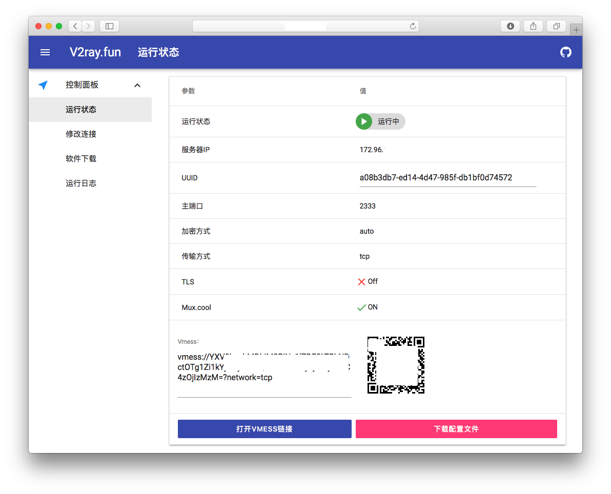
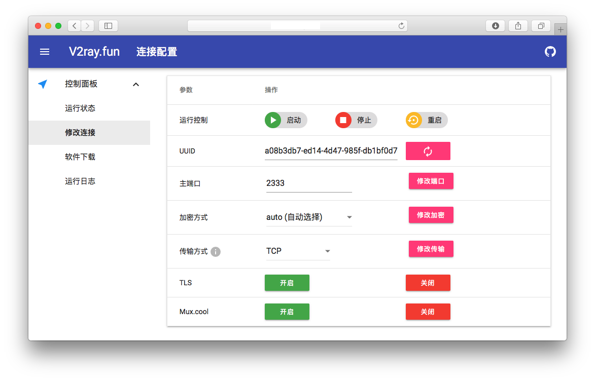

# V2ray.Fun

## 简介

一个基于 Web 的 V2ray 控制面板





## 系统支持

**请务必使用新系统，纯净的VPS系统安装!!!**

- **Debian 8 (推荐)**
- Debian 9
- Ubuntu 14
- Ubuntu 16

## 一键安装

不保证一键脚本能安装成功，推荐手动安装，方便解决错误

```bash
wget -N --no-check-certificate https://raw.githubusercontent.com/YLWS-4617/V2ray.Fun/master/install.sh && bash install.sh
```

## 手动安装

首先安装依赖

```bash
apt-get update
apt-get install python python-pip unzip curl openssl ca-certificates screen socat git -y
```

安装 **acme.sh** 用于开启 V2ray TLS 功能

```bash
curl https://get.acme.sh | sh
```

安装 **V2ray** 主程序

```bash
bash <(curl -L -s https://install.direct/go.sh)
```

安装 **V2ray.Fun** 主程序

```bash
cd /usr/local/
git clone https://github.com/YLWS-4617/V2ray.Fun
```

安装需要用的 Python 包

```bash
pip install flask pyOpenSSL requests urllib3 Flask-BasicAuth -y
```

初始化配置文件和执行文件

```bash
sed -i "s/%%username%%/admin/g" /usr/local/V2ray.Fun/panel.config
sed -i "s/%%passwd%%/admin/g" /usr/local/V2ray.Fun/panel.config
sed -i "s/%%port%%/5000/g" /usr/local/V2ray.Fun/panel.config
cd /usr/local/V2ray.Fun/ && python init.py
cp /usr/local/V2ray.Fun/v2ray.py /usr/local/bin/v2ray
chmod +x /usr/local/bin/v2ray
```

启动服务

```bash
cd /usr/local/V2ray.Fun/ && screen -dmS Flask python app.py
service v2ray start
```

然后就装好了，访问 **http://你的IP:5000** 就可以使用Web面板了

